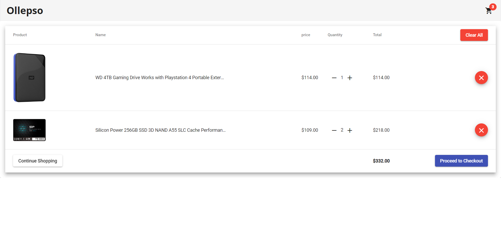
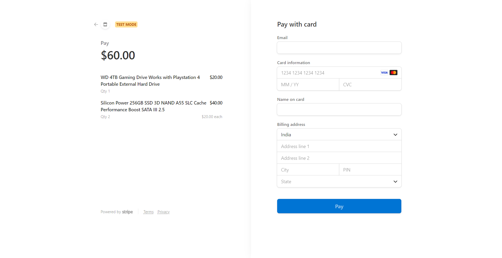

# Ollepso
Ollepso is an online e-commerce website that offers a user-friendly platform for customers to browse and purchase products. Built using Angular, HTML, SCSS, JavaScript, and TypeScript, the site provides a seamless experience for customers to search and add items to their cart.

The site's backend server is built with ExpressJS, which ensures reliable and efficient communication between the client and server. Ollepso also integrates Stripe as a payment gateway, offering secure and easy-to-use payment options for customers.

One of the main features of Ollepso is its extensive product catalog, which offers a wide range of products in various categories. Customers can browse through the catalog, select items they wish to purchase, and add them to their cart. They can also modify their cart by adding or removing items, as well as deleting items they no longer wish to purchase.

With its simple and intuitive interface, Ollepso offers a convenient and hassle-free shopping experience for customers. The site is optimized for desktop and mobile devices, making it easy to shop on-the-go.


### Accessing the Source Code
* Navigate to the "master" branch of the repository.
* Clone the repository to your local machine using the following command:
* ```git clone https://github.com/ManikDeepak/Ollepso.git```
* Once the repository is cloned, you can access the source code in the "master" directory.


#### Screenshots of the app
>Home Page

>Cart

>Payment Gateway using Strip

